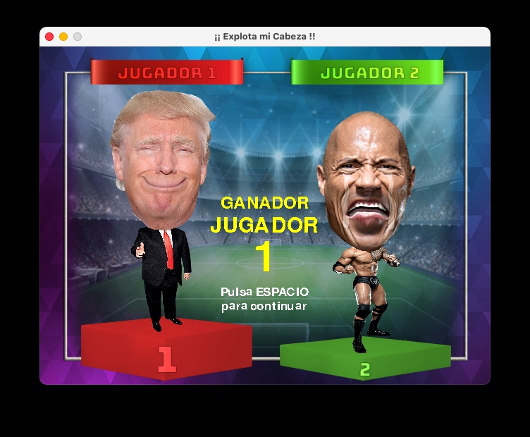

# ¡¡Explota mi cabeza!!
Mini juego de habilidad para 2 jugadores

Este juego es el proyecto final de la asignatura de primer curso Fundamentos de Programación, que pertenece al Grado en Gestión de Información y Contenidos Digitales de la Universidad de Murcia.

El proyecto ha sido realizado entre enero y mayo de 2022.

El desarrollo de código y gráficos ha sido realizado íntegramente por Pedro Otálora.
Programado en Phyton.

**GUION DEL JUEGO** 
El proyecto “Explota mi cabeza” es un minijuego para dos jugadores en el que se mide la habilidad de cada jugador para vencer al adversario.

**Dinámica del juego**
La dinámica del juego es muy sencilla: Tras una cuenta atrás, cada jugador tiene asignadas cuatro letras de su zona del teclado correspondiente (izquierda o derecha). Debajo de cada personaje aparece una letra marcada al azar y el jugador tiene que pulsar la tecla lo más rápido posible. Cada pulsación de la letra acertada, la cabeza de su personaje aumenta de tamaño por pasos, siendo el objetivo del juego conseguir que la cabeza del personaje crezca más rápido que la del oponente hasta que estalle. Si el jugador pulsa una tecla de su set de letras que no corresponde con la letra marcada, la cabeza en vez de inflarse, se deshinchará un paso, consiguiendo con esto que dar más emoción al juego al mismo tiempo que se evita que el jugador pulse muchas teclas de manera aleatoria y de forma muy rápida y consiga ganar haciendo “spam” en el teclado.
Para ganar la partida se han de ganar dos rondas, si tras el segundo torneo se produce un empate, habrá una ronda extra de desempate.

**Modos de juego**
Se han incorporado dos modos de juego: en el modo 1 (modo normal), cada jugador va pulsando las teclas que le correspondan sin preocuparse del otro jugador. En cambio, en el modo 2 (modo “troll”), cuando un jugador acierta una letra, hace que la letra del jugador contrario también cambie, con lo que el otro jugador debe estar muy atento, pues su letra puede cambiar en cualquier momento provocando que su pulsación sea errónea.

**Pantallas y secciones**
El juego se inicia con una pantalla de título animada, donde además de una pequeña animación de personajes aleatorios y unas figuras girando, aparece el personaje que más partidas ha ganado indicando las partidas que lleva ganadas en total. Este “récord” queda registrado con cada partida y se va almacenando en el fichero de configuración. Para continuar se puede pulsar espacio o bien se puede hacer click con el ratón.
A continuación se muestra una pantalla de instrucciones donde se explica brevemente el cometido del juego, y se permite elegir el modo de juego entre los dos disponibles. La selección de modo de juego se puede realizar con las teclas “1” o “2” del teclado, o bien pulsando con el ratón en el botón correspondiente de cada modo.
Después pasamos a la pantalla de selección de personajes. Aquí se muestran los personajes con una leyenda en la parte superior de cada uno indicando las partidas ganadas que tienen acumuladas. De nuevo podemos seleccionar el personaje, primero el del jugador 1 y después el del jugador 2. La selección se puede hacer  con los cursores del teclado y la barra espaciadora o bien haciendo clic con el ratón. Se ha incorporado una comprobación para que el jugador 2 no pueda elegir el mismo personaje que ya haya seleccionado el otro jugador.

**Pantalla de juego principal y fin de partida**
Una vez elegidos los jugadores pasamos a la primera ronda. Para empezar se visualiza una cuenta atrás para que se preparen los jugadores. Una vez iniciado el juego comienzan a aparecer debajo de cada personaje las letras que debe pulsar. Si es el modo de juego 2, cada acierto de cualquier jugador cambiará ambas letras. Como se ha comentado, cada acierto incrementa la cabeza de jugador y cada fallo la hace disminuir. Cuando uno de los jugadores llegue al tamaño máximo, se visualiza la explosión del jugador y se pasa a la siguiente ronda, cambiando el escenario y la música de fondo. En la segunda ronda, si se produce un empate, habrá una ronda de desempate con un nuevo escenario. Cuando uno de los dos jugadores consiga dos rondas seguidas, aparecerá un podio con el ganador sonriendo y el perdedor llorando. Una vez que se pulse espacio o se haga click, se actualizará el fichero de récord y se volverá a la pantalla de inicio. Durante las rondas tendremos en pantalla información sobre la puntuación de cada jugador en la partida actual.

Para la música de fondo de las diferentes fases se han seleccionado recortes de pistas de juegos clásicos que forman parte de la época dorada del videojuego. Para recortar y normalizar volúmenes se ha utilizado la herramienta Audacity.
Los gráficos han sido elaborados con Photoshop, utilizando imágenes con extensión jpg para los fondo de pantalla e imágenes en formato png para preservar la transparencia en los personajes.

